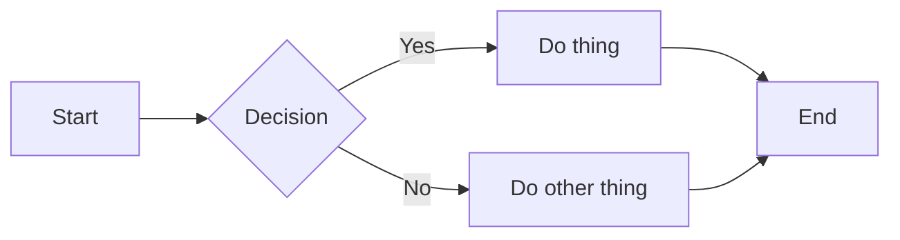
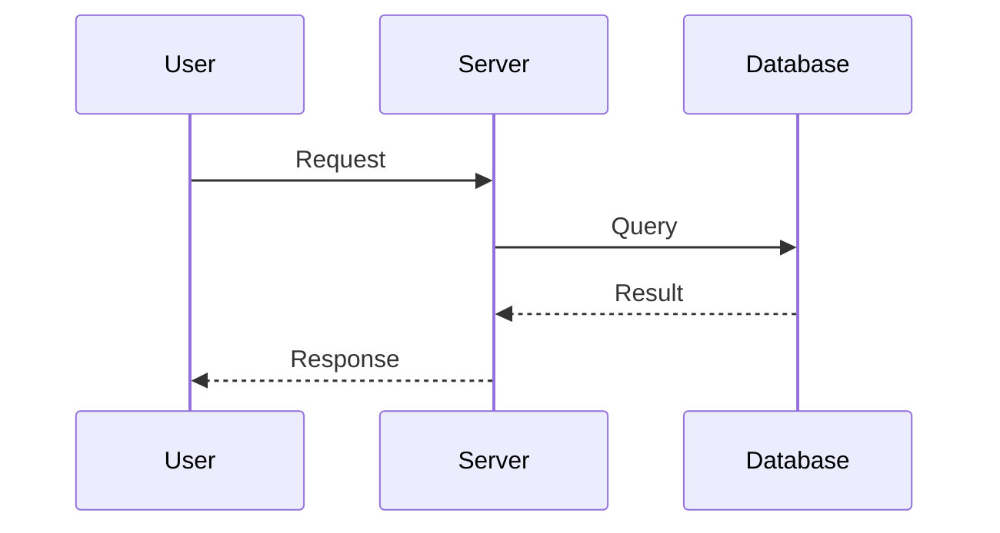
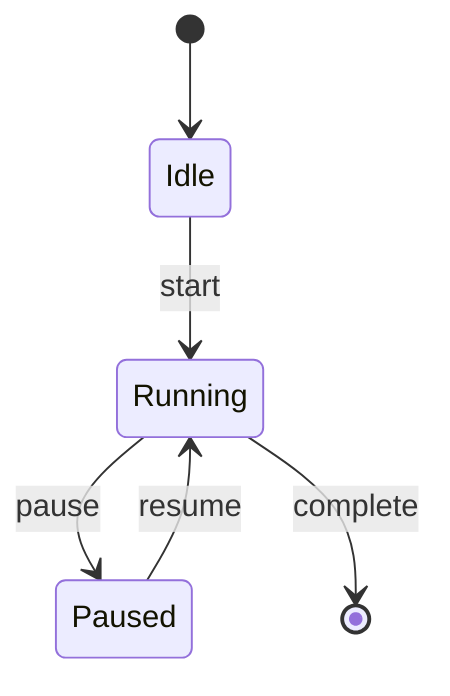
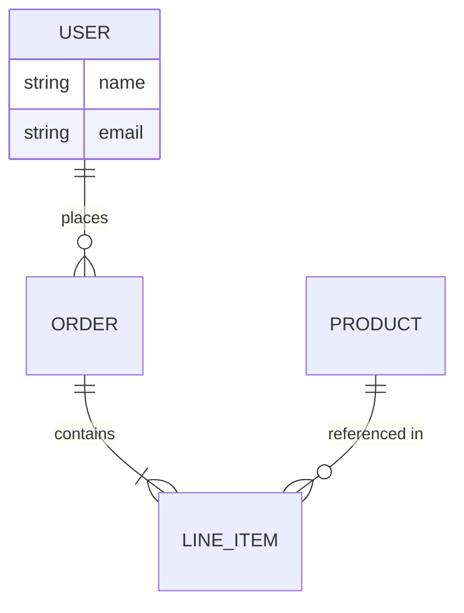
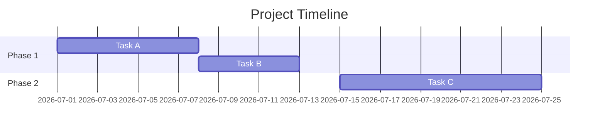
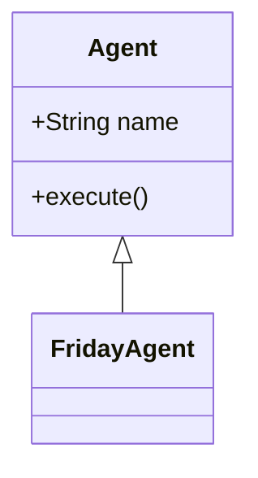
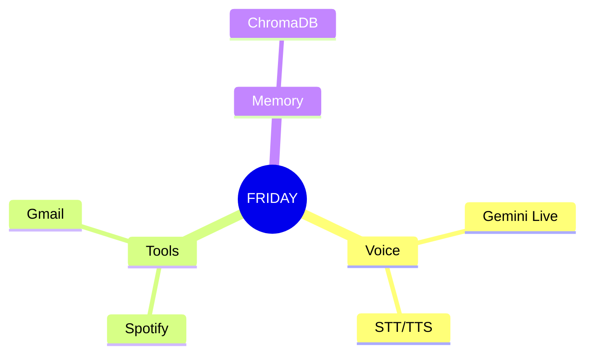
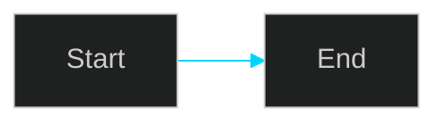

# Diagrams — FRIDAY Playbook (Full)

## 0. Environment setup

```powershell
npm install -g @mermaid-js/mermaid-cli
# mmdc needs a Chromium instance under the hood — first run may auto-download
# puppeteer's bundled chromium; if it fails, install manually:
npm install -g puppeteer
```

```bash
python friday/skills/diagrams/scripts/check_env.py
```

## 1. Use Mermaid for anything with real graph structure

Flowcharts, sequence diagrams, state diagrams, ER diagrams, Gantt charts —
write Mermaid syntax and render it, rather than hand-coding SVG shapes and
connectors. Mermaid solves the layout math (spacing, routing, avoiding
overlap) that's genuinely hard to get right by hand and isn't worth
re-deriving per diagram.

```bash
mmdc -i diagram.mmd -o diagram.svg -b transparent
mmdc -i diagram.mmd -o diagram.png -w 1400 -b white
```

## 2. Syntax reference — all diagram types

**Flowchart:**


**Sequence:**


**State:**


**ER (entity-relationship):**


**Gantt:**


**Class diagram** (for code architecture docs):


**Mind map:**


## 3. Gotchas

- Always wrap node/edge labels in quotes: `["Text"]`, `|"Edge label"|` —
  unquoted labels break on parentheses, colons, or other special characters.
- Default flowchart direction is top-down (`TD`); set `LR` explicitly for
  anything wide, keep `TD` for anything tall/hierarchical — don't leave this
  to chance on complex diagrams.
- No emoji inside Mermaid labels — export rendering support is inconsistent.
- Keep it simple unless detail is explicitly requested — a 40-node
  auto-layout flowchart is usually worse than two focused 10-node diagrams.
- Color styling (`style NodeName fill:#...`) works for flowcharts, use
  sparingly — reserve for genuinely meaningful distinctions (e.g. highlight
  the critical path), not decoration.
- ER diagram cardinality notation: `||` = exactly one, `o{` = zero or many,
  `|{` = one or many — get these backwards and the diagram tells a wrong
  data-model story, worth double-checking against the actual schema.

## 4. Theming to match FRIDAY's visual direction

Mermaid supports a `%%{init}%%` directive for custom theming — use this for
dark-neon-consistent diagrams when the context calls for it:



## 5. When NOT to use Mermaid

- Free-form illustrations, icons, anything without graph structure → use
  `svg/SKILL.md` instead.
- Pixel-precise custom shapes matching a specific brand style (not just
  boxes/arrows) → hand-authored SVG, budget real time for it.
- A diagram that needs to be an editable native PowerPoint object (not an
  image) → build directly with `python-pptx` shapes instead of embedding a
  Mermaid-rendered image; see pptx/SKILL.md §7 for native shape patterns.

## 6. Verify before delivering (mandatory)

```bash
python friday/skills/diagrams/scripts/verify_diagram.py diagram.mmd
```

Renders to PNG and reports basic sanity (non-empty output, reasonable file
size). Mermaid syntax errors sometimes fail silently or produce a garbled
partial render rather than a hard error — always view the rendered output,
don't trust "the command exited 0."

Manual check:
```bash
mmdc -i diagram.mmd -o preview.png -w 1200
```
View `preview.png`. Check: no overlapping labels, arrows connect to correct
nodes, text isn't clipped inside node boxes.

## 7. Windows-specific gotchas

- `mmdc` relies on a bundled Chromium (via puppeteer) — corporate/locked-down
  Windows environments sometimes block the auto-download; if `mmdc` hangs on
  first run, manually run `npx puppeteer browsers install chrome`.
- Long file paths for the `-i`/`-o` flags: use relative paths from a short
  working directory if FRIDAY's project path is deeply nested, to avoid
  Windows path-length issues.

## Dependencies

`@mermaid-js/mermaid-cli` (npm, global install, provides `mmdc`) · Node.js
runtime (should already be present on FRIDAY's host given the JS/Node
tooling elsewhere in the stack)

## Scripts in this skill

- `scripts/check_env.py` — verifies `mmdc` is on PATH and can actually
  render (catches the Chromium-download issue before a real task hits it)
- `scripts/verify_diagram.py` — renders a `.mmd` file to PNG and reports
  basic sanity checks (file exists, non-trivial size)
